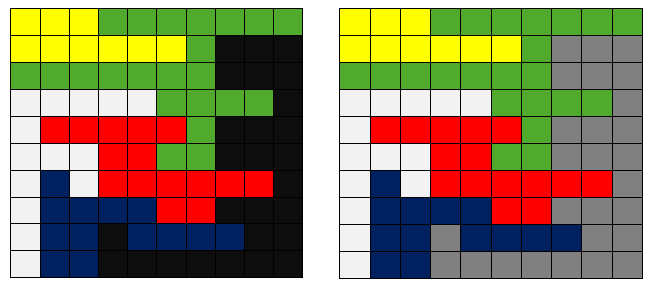

## Flood-fill algorithm
Flood fill (also known as seed fill) is an algorithm that determines the area connected to a given node in a multi-dimensional array.

It is used in the "bucket" fill tool of paint program to fill connected, similarly-colored areas with a different color, and in games such as Go and Minesweeper for determining which pieces are cleared. When applied on an image to fill a particular bounded area with color, it is also known as boundary fill.

The flood-fill algorithm takes three parameters: a start node, a target color, and a replacement color.

Consider below matrix to the left – if start node = (3, 9), target color = "BLACK" and replacement color = **"GREY"**, the algorithm looks for all nodes in the matrix that are connected to the start node by a path of the target color and changes them to the replacement color.

##### Approach 1: (Using BFS)
A queue-based implementation using BFS is shown below in pseudo-code.

**BFS (starting-pixel, replacement-color)**
 1\. Create an empty queue   
2\. Enqueue starting pixel and mark it as processed   
3\. do till queue is not empty   
   a) Pop front node from the queue and process it  
   b) Replace color of current pixel (popped node) with that of replacement  
   c) Process all 8 adjacent pixels of current pixel and enqueue each valid  
      pixel which has same color as that of current pixel

##### Approach 2: (Using DFS)
We can use DFS to solve this problem. The idea is to start from the source node in the matrix, replace its color with replacement color and recursively explore all its valid eight adjacent pixels and replace their color as well. Note that we don’t need a visited array here as we are replacing the color of every processed node and it won’t be considered again next time as it will have a different color. 

The time complexity of both solutions is O(MN).