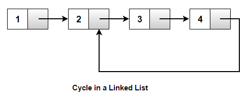

## Floyd's cycle detection algorithm

Floyd’s Cycle Detection Algorithm is a pointer algorithm that uses only two pointers, which move through the sequence at different speeds. The idea is to move fast pointer twice as quickly as the slow pointer and the distance between them increases by 1 at each step. If at some point both meet, we have found a cycle in the list, else if we have reached the end of the list, no cycle is present. It is also called the "tortoise and the hare algorithm".

The time complexity of above solution is O(n) and auxiliary space used by the program is O(1).