## Kruskal's algorithm
**Problem**
Given an undirected, connected and weighted graph, construct a minimum spanning tree out of it.

A Minimum Spanning Tree is a spanning tree of a connected, undirected graph. It connects all the vertices together with the minimal total weighting for its edges.

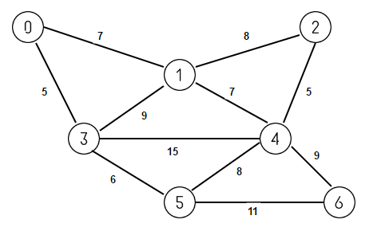

For example, consider above graph. Its minimum spanning tree will be below tree with exactly N-1 edges where N is number of vertices in the graph and sum of weights of edges is as minimum as possible.  
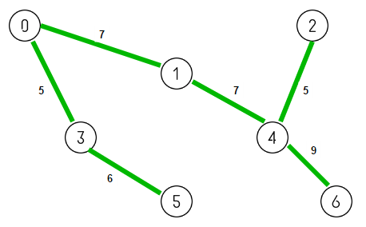

We can use **Kruskal’s Minimum Spanning Tree** algorithm which is a greedy algorithm to find a minimum spanning tree for a connected weighted graph. Kruskal’s Algorithm works by finding a subset of the edges from the given graph covering every vertex present in the graph such that they forms a tree (called MST) and sum of weights of edges is as minimum as possible.

Let G = (V, E) be the given graph. Initially our MST contains only vertices of given graph with no edges. In other words, initially MST has V connected components with each vertex acting as one connected component. The goal is to add minimum weight edges to our MST such that we are left with single connected component that comprises all the vertices of graph. Below is the complete algorithm –

  
Sort all edges in the graph G in the order of their increasing weights;  
repeat V-1 times    // as MST contains V-1 edges  
{  
    Select the next edge with minimum weight from the graph G;  
   
    if (no cycle is formed by adding the edge in MST i.e. the edge connects two  
            different connected components in MST)  
        add the edge to MST;  
}  

Let’s illustrate this by taking example of above graph. Initially our MST consists of only the vertices of given graph with no edges. We start by considering smallest weighted edge 0-3 having weight 5. As no cycle is formed, we include it in our MST.

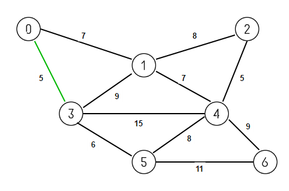

We next consider smallest weighted edge 2-4 also having weight 5. As no cycle is formed, we include it in our MST.

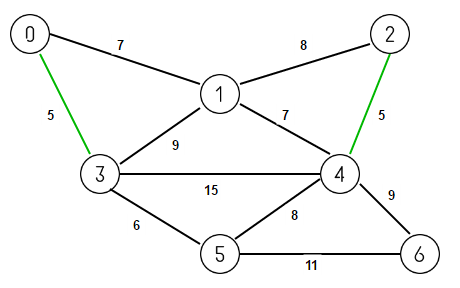

We next consider smallest weighted edge 3-5 having weight 6. As no cycle is formed, we include it in our MST.

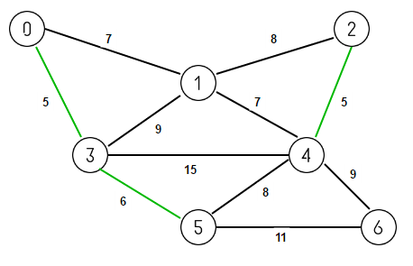

We next consider smallest weighted edge 0-1 having weight 7. As no cycle is formed, we include it in our MST.

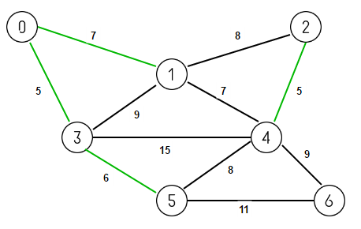

We next consider smallest weighted edge 1-4 also having weight 7. As no cycle is formed, we include it in our MST.

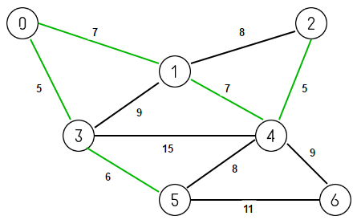

We next consider smallest weighted edge 5-4 having weight 8. But including this edge in MST will result in a cycle 0-1-4-5-3-0, so we discard it.

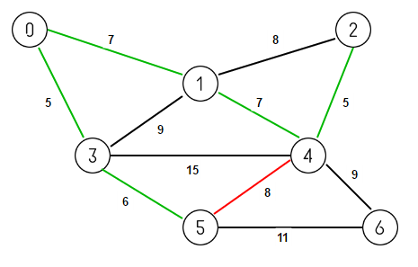

We next consider smallest weighted edge 1-2 also having weight 8. But including this edge in MST will result in a cycle 1-2-4-1, so we discard it.

We next consider smallest weighted edge 3-1 also having weight 9. But including this edge in MST will result in a cycle 0-1-3-0, so we discard it.

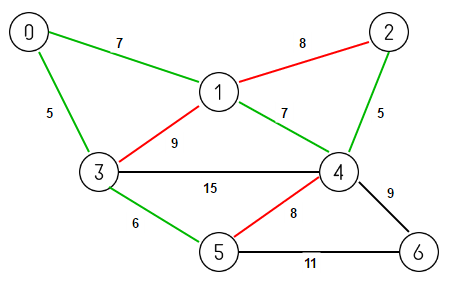

Finally we consider next smallest weighted edge 4-6 also having weight 9. As no cycle is formed, we include it in our MST.  

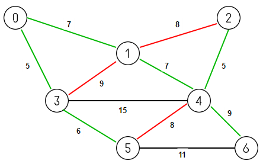

MST is now connected (contaning V-1 edges). So we discard all remaining edges.

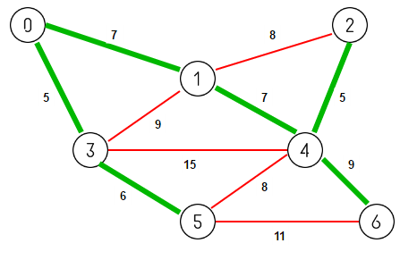

Below is the pseudocode of Kruskal’s Algorithm. It uses the disjoint-set data structure.

KRUSKAL(graph G)  
  
MST = {}  
   
for each vertex v belonging G.V:  
    MAKE-SET(v)  
      
for each (u, v) in G.E ordered by weight(u, v), increasing:  
    if FIND-SET(u) != FIND-SET(v):  
        add {(u, v)} to set MST  
        UNION(u, v)  
   
return MST  

Please note that if the graph is not connected, then Kruskal’s Algorithm finds a **Minimum Spanning Forest** which is a minimum spanning tree for each connected component of the graph.
