## Bellman-Ford shortest path algorithm
**Problem**
Given a source vertex s from set of vertices V in a weighted graph where its edge weights w(u, v) can be negative, find the shortest-path weights d(s, v) from given source s for all vertices v present in the graph. If the graph contains negative-weight cycle, report it.

For example, consider below graph

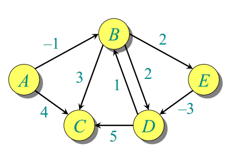

**Output:**  
Distance of vertex 0 from the source is  0. It's path is \[ 0 \]  
Distance of vertex 1 from the source is -1. It's path is \[ 0 -> 1 \]  
Distance of vertex 2 from the source is  2. It's path is \[ 0 -> 1 -> 2 \]  
Distance of vertex 3 from the source is -2. It's path is \[ 0 -> 1 -> 4 -> 3 \]  
Distance of vertex 4 from the source is  1. It's path is \[ 0 -> 1 -> 4 \]  

The idea is to use Bellman–Ford algorithm to compute the shortest paths from a single source vertex to all of the other vertices in given weighted digraph. Bellman–Ford algorithm is slower than Dijkstra’s Algorithm but it is capable of handling negative weights edges in the graph unlike Dijkstra’s.

Note that if a graph contains a "negative cycle" (i.e. a cycle whose edges sum to a negative value) that is reachable from the source, then there is no shortest path. Any path that has a point on the negative cycle can be made cheaper by one more walk around the negative cycle. Bellman–Ford algorithm can easily detect any negative cycles in the graph.

The algorithm initializes the distance to the source to 0 and all other nodes to infinity. Then for all edges, if the distance to the destination can be shortened by taking the edge, the distance is updated to the new lower value. At each iteration i that the edges are scanned, the algorithm finds all shortest paths of at most length i edges. Since the longest possible path without a cycle can be V-1 edges, the edges must be scanned V-1 times to ensure the shortest path has been found for all nodes. A final scan of all the edges is performed and if any distance is updated, then a path of length |V| edges has been found which can only occur if at least one negative cycle exists in the graph.

Below is the psedocode for Bellman-Ford. The implementation takes in a graph, represented as lists of vertices and edges, and fills distance\[\] and parent\[\] with shortest-path (least cost/path) information –  
```
function BellmanFord(list vertices, list edges, vertex source,  
                    distance\[\], parent\[\])  
   
// Step 1 – initialize graph. At the beginning, all vertices have a weight of  
// infinity and a null parent, except for the Source, where the weight is 0  
   
for each vertex v in vertices  
    distance\[v\] = INFINITY  
    parent\[v\] = NULL  
   
distance\[source\] = 0  
// Step 2 – relax edges repeatedly  
    for i = 1 to V-1    // V – No. of vertices  
        for each edge (u, v) with weight w  
             if (distance\[u\] + w) is less than distance\[v\]  
                distance\[v\] = distance\[u\] + w  
                parent\[v\] = u  
   
// Step 3 – check for negative-weight cycles  
for each edge (u, v) with weight w  
    if (distance\[u\] + w) is less than distance\[v\]  
        return “Graph contains a negative-weight cycle”  
   
return distance\[\], parent\[\]  
```
Below slideshow illustrates the working of Bellman Ford Algorithm. The images are taken from MIT 6.046J/18.401J Introduction to Algorithms (Lecture 18 by Prof. Erik Demaine).


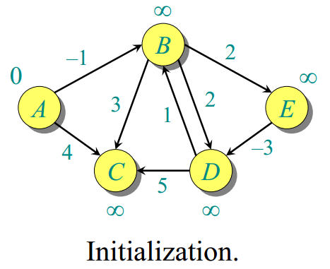

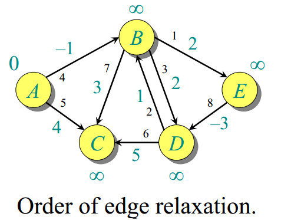

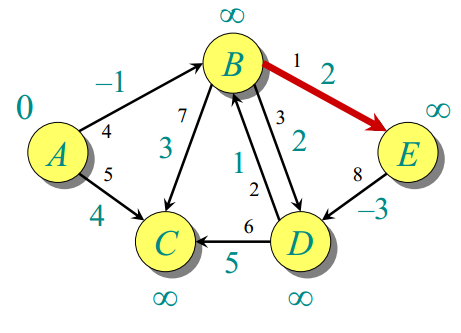

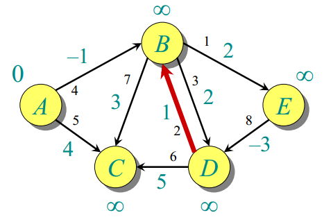

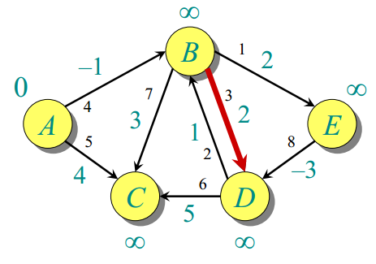

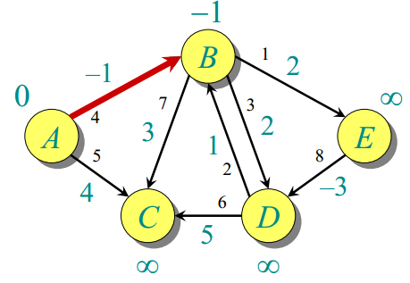

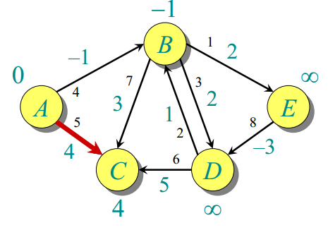

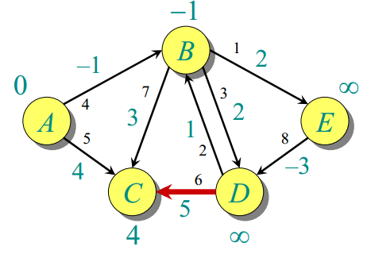

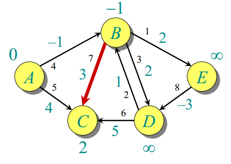

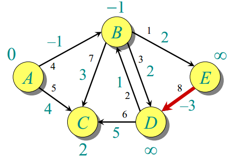

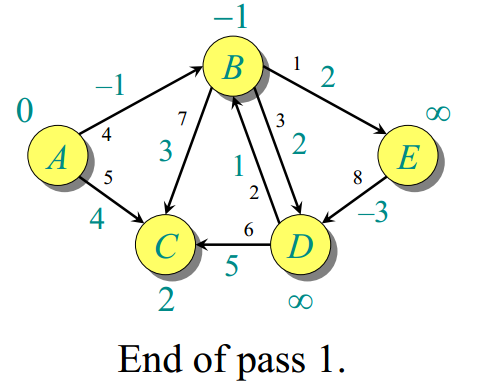

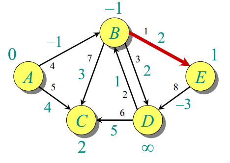

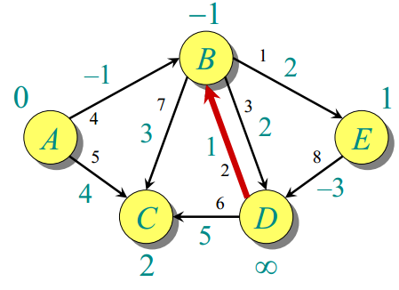

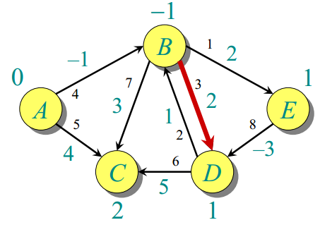

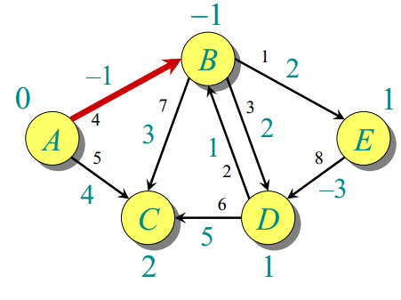

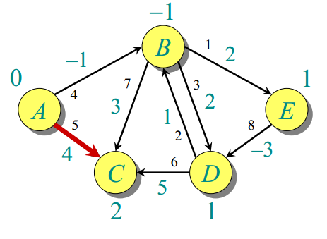

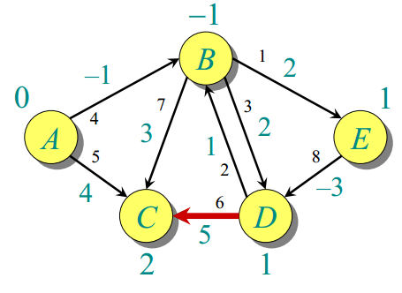

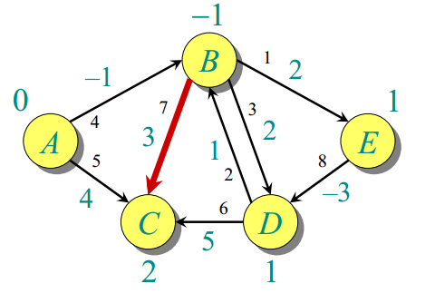

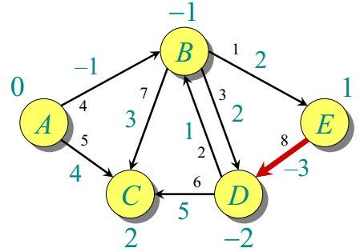

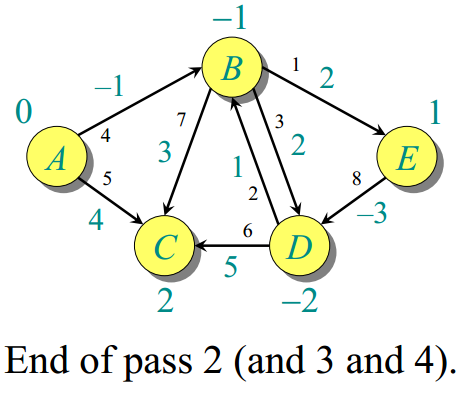

The time complexity of Bellman–Ford algorithm is O(VE) where V and E are the number of vertices and edges in the graph respectively.
