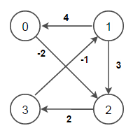
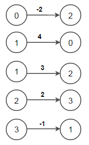
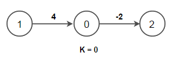
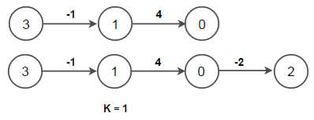
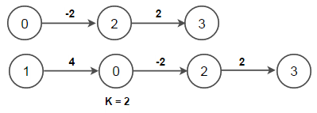
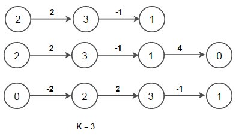

## Floyd Warshall shortest path algorithm
**Problem**
Given a set of vertices V in a weighted graph where its edge weights w(u, v) can be negative, find the shortest-path weights d(s, v) from every source s for all vertices v present in the graph. If the graph contains negative-weight cycle, report it.

For example, consider below input graph –



  
**Output:**  
Adjacency matrix containing shortest distance is –  
0 -1 -2 0  
4 0 2 4  
5 1 0 2  
3 -1 1 0  

Shortest Path from vertex 0 to vertex 1 is (0 2 3 1)  
Shortest Path from vertex 0 to vertex 2 is (0 2)  
Shortest Path from vertex 0 to vertex 3 is (0 2 3)  
Shortest Path from vertex 1 to vertex 0 is (1 0)  
Shortest Path from vertex 1 to vertex 2 is (1 0 2)  
Shortest Path from vertex 1 to vertex 3 is (1 0 2 3)  
Shortest Path from vertex 2 to vertex 0 is (2 3 1 0)  
Shortest Path from vertex 2 to vertex 1 is (2 3 1)  
Shortest Path from vertex 2 to vertex 3 is (2 3)  
Shortest Path from vertex 3 to vertex 0 is (3 1 0)  
Shortest Path from vertex 3 to vertex 1 is (3 1)  
Shortest Path from vertex 3 to vertex 2 is (3 1 0 2)  

We have already covered **single-source shortest paths** in separate posts. We have seen that
* For graphs having non-negative edge weights, Dijkstra’s Algorithm runs in O(E + V lg V)
* For graphs containing negative edge weights, Bellman-Ford runs in O(V.E).
* For a DAG, one pass of Bellman-Ford _(called relaxation step)_ is enough that will take O(V + E) time.

Here, V is number of vertices and E is number of edges in the graph.

In this post, we will introduce **All-Pairs Shortest Paths** that returns the shortest paths between every of vertices in graph that can contain negative edge weights.

If the graph contains only positive edge weights, a simple solution would be to run Dijkstra’s algorithm V times. The time complexity of this solution would be O(V(E + V lg V)) i.e. O(VE + V2 lg V)

If the graph contains negative edge weights, then to find all-pairs shortest paths we can run Bellman-Ford once from each vertex. The time complexity of this approach will be O(V2E). If the graph is dense i.e. E = V2, then the time complexity becomes O(V4). 

**Floyd–Warshall algorithm** is an algorithm for finding shortest paths in a weighted graph with positive or negative edge weights (but with no negative cycles). It does so by comparing all possible paths through the graph between each pair of vertices and that too with O(V3) comparisons in a graph.

Below is the psedocode for Floyd Warshall. The implementation takes in a graph, represented by adjacency matrix and fills dist\[\] with shortest-path (least cost) information –
```
let dist be a V x V matrix of minimum distances initialized to infinity  
for each vertex v  
    dist\[v\]\[v\] = 0  
for each edge (u, v)  
    dist\[u\]\[v\] = weight(u,v)  
   
for k from 0 to |V| – 1  
    for i from 0 to |V| – 1  
        for j from 0 to |V| – 1  
            if (dist\[i\]\[k\] + dist\[k\]\[j\]) is less than dist\[i\]\[j\] then  
                dist\[i\]\[j\] = dist\[i\]\[k\] + dist\[k\]\[j\]  
```
Above psedocode picks a vertex k from 0 to V-1 one by one and include that vertex as an intermediate vertex in the shortest path between every pair of edges i->j in the graph. We update the cost matrix whenever we found a shorter path from i to j through vertex k. Since for a given k, we have already considered vertices \[0..k-1\] as intermediate vertices, this approach works.

Let’s consider above graph,

Before first iteration of the outer for loop for k, the only known paths corresponds to the single edges in the graph.



**At k = 0, paths that go through the vertex 0 are found**: in particular, the path \[1, 0, 2\] is found, replacing the path \[1, 2\] which has fewer edges but is costly.  



**At k = 1, paths going through the vertices {0, 1} are found**. The below figure shows how the path \[3, 1, 0, 2\] is assembled from the two known paths \[3, 1\] and \[1, 0, 2\] encountered in previous iterations, with 1 in the intersection. The path \[3, 1, 2\] is not considered, because \[1, 0, 2\] is the shortest path encountered so far from 1 to 2.  



**At k = 2, paths going through the vertices {0, 1, 2} are found.** 



**Finally, at k = 3, all shortest paths are found.**  



The Floyd–Warshall algorithm is very simple to code and really efficient in practice. It can also be used to for finding the Transitive Closure of graph and **detecting negative weight cycles** in the graph.

To detect negative cycles using the Floyd–Warshall algorithm, we need to the check diagonal of the distance matrix for presence of a negative number as it indicates that the graph contains at least one negative cycle.

**How does this work?**
The Floyd–Warshall algorithm iteratively revises path lengths between all pairs of vertices (i, j), including where i = j. Initially, the length of the path (i, i) is zero. A path \[i, k…i\] can only improve upon this if it has length less than zero, i.e. denotes a negative cycle. Thus, after the algorithm, (i, i) will be negative if there exists a negative-length path from i back to i.

The time complexity of Floyd–Warshall algorithm is O(V3) where V is number of vertices in the graph.

Johnson’s algorithm can also be used to find the shortest paths between all pairs of vertices in a sparse,  weighted, directed graph. It allows some of the edge weights to be negative numbers, but no negative-weight cycles may exist. It uses the Bellman–Ford algorithm to transform the input graph such that it removes all negative weights from the graph and run Dijkstra’s algorithm on the transformed graph.
