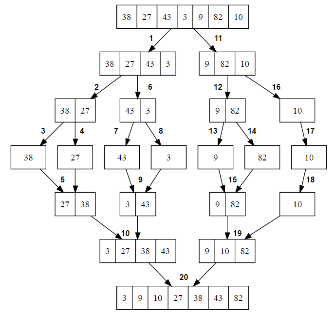

## Merge sort
Merge sort is an efficient sorting algorithm which produces a stable sort, which means that if two elements have the same value, they holds same relative position in the output as they did in the input. In other words, the relative order of elements with equal values is preserved in the sorted output. Merge sort is a comparison sort which means that it can sort any input for which a _less-than_ relation is defined.

Merge sort is a divide and conquer algorithm. Like all divide and conquer algorithms, merge sort divides a large array into two smaller subarrays and then recursively sort the subarrays. Basically, there are two steps are involved in whole process:
1. Divide the unsorted array into n subarrays, each of size 1 (an array of size 1 is considered sorted).   
2. Repeatedly merge subarrays to produce new sorted subarrays until only 1 subarray is left which would be our sorted array.

   
The diagram below shows top-down view of recursive merge sort algorithm used to sort an array of 7 integers:

   
Worst case time complexity of merge sort is **O(nlog(n))** and the auxiliary space required by it is **O(n)**.