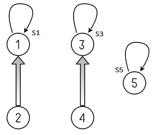
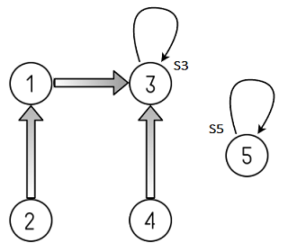

Disjoint-Set Data Structure (Union Find Algorithm)
==================================================
**Problem:** 
We have some number of items. We are allowed to merge any two items to consider them equal. At any point, we are allowed to ask whether two items are considered equal or not.

##### What is a disjoint-set?
A disjoint-set is a data structure that keeps track of a set of elements partitioned into a number of disjoint (non-overlapping) subsets. In other words, **disjoint set is a group of sets where no item can be in more than one set**. It is also called an union–find data structure as it supports union & find operations on subsets. Lets begin by defining them –

**_Find_:** It determines in which subset a particular element is in and returns the representative of that particular set. An item from this set typically acts as a “representative” of the set.
**_Union_:** It merges two different subsets into a single subset and representative of one set becomes representative of other.

The disjoint-set also supports one other important operation called **MakeSet** which creates a set containing only a given element in it.

##### How does union–find work?

We can determine whether two elements are in the same subset or not by comparing the result of two _Find_ operations. If the two elements are in the same set, they have same representative else they belong to different sets. If the union is called on two elements, we merge the two subsets which the two elements were belonging to.

##### How to implement Disjoint sets?

**Disjoint-set forests** are data structures where each set is represented by a tree data in which each node holds a reference to its parent node and the representative of each set is the root of that set’s tree.
*   **_Find_** follows parent nodes until it reaches the root.
*   **_Union_** combines two trees into one by attaching the root of one tree into the root of the other.

For example, consider five disjoint sets S1, S2, S3, S4 and S5 that are represented by a tree as shown in below diagram. Each set initially contains only one element each so their parent pointer is pointing to itself or to NULL.  
S1 = {1}, S2 ={2}, S3 = {3}, S4 ={4} and S5 = {5}  
The _Find_ operation on element i will return representative of Si where 1 <= i <= 5. i.e. _Find_(i) = i

If we do _Union_ (S3, S4), S3 and S4 will be merged into one disjoint set S3. Now  
S1 = {1}, S2 ={2}, S3 = {3, 4} and S5 = {5}.  
_Find_(4) will return representative of set S3. i.e. _Find_(4) = 3

If we do _Union_ (S1, S2), S1 and S2 will be merged into one disjoint S1. Now  
S1 = {1, 2}, S3 = {3, 4} and S5 = {5}.  
_Find_(2) or _Find_(1) will return representative of set S1. i.e. _Find_(2) = _Find_(1) = 1

If we do _Union_ (S3, S1), S3 and S1 will be merged into one disjoint set S3. Now  
S3 = {1, 2, 3, 4} and S5 = {5}.

One way of implementing these might be:

**function** _MakeSet_(x)  
    x.parent = x  

**function** _Find_(x)  
    if x.parent == x  
        return x  
    else  
        return _Find_(x.parent)  

**function** _Union_(x, y)  
    xRoot = _Find_(x)  
    yRoot = _Find_(y)  
    xRoot.parent = yRoot  
 
The above approach is no better than the linked-list approach, because the tree it creates can be highly unbalanced; however, it can be enhanced in two ways:
1. The first way, called **_union by rank_**, is to always **attach the smaller tree to the root of the larger tree**. Since it is the depth of the tree that affects the running time, the tree with smaller depth gets added under the root of the deeper tree, which only increases the depth if the depths were equal. Single element tree are defined to have a rank of zero, and whenever two trees of the same rank _r_ are united, the rank of the result is _r_+1. The worst-case running-time improves to _O_(log _n_) for the _Union_ or _Find_ operation.
2. The second improvement, called **path compression**, is a way of flattening the structure of the tree whenever _Find_ is used on it. The idea is that each node visited on the way to a root node may as well be attached directly to the root node; they all share the same representative. To effect this, **as _Find_ recursively traverses up the tree, it changes each node’s parent reference to point to the root that it found.** The resulting tree is much flatter, speeding up future operations not only on these elements but on those referencing them, directly or indirectly.

Pseudocode for the improved MakeSet and _Union_:

**function** _MakeSet_(x)  
    x.parent = x  
    x.rank = 0  
  
**function** _Union_(x, y)  
    xRoot = _Find_(x)  
    yRoot = _Find_(y)  
    if xRoot == yRoot  
        return  
   
    // x and y are not already in same set. Merge them.  
    if xRoot.rank < yRoot.rank  
        xRoot.parent = yRoot  
    else if xRoot.rank > yRoot.rank  
        yRoot.parent = xRoot  
    else  
        yRoot.parent = xRoot  
        xRoot.rank = xRoot.rank + 1  

##### Applications of Union Find Algorithm
1. Implementing Kruskal’s Algorithm to find the minimum spanning tree of a graph.
2. Detecting Cycle in Undirected graph
