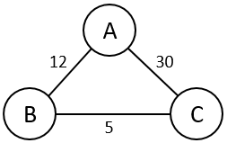

Graph
=====
Formally, a graph consists of the following:
* A set of elements called nodes (or vertices)
* A set of connections between pairs of nodes called edges

A graph can be represented using an adjacency matrix or an adjacency list.

Shortest path
-------------
```
dijkstra(s):
    // perform initialization step
    pq = empty priority queue
    for each vertex v:
        v.dist = infinity           // the maximum possible distance from s
        v.prev = NULL               // we don't know the optimal previous node yet
        v.done = False              // v has not yet been discovered

    // perform the traversal
    enqueue (0, s) onto pq          // enqueue the starting vertex
    while pq is not empty:
        dequeue (weight, v) from pq
        if v.done == False:         // if the vertex's min path hasn't been discovered yet
            v.done = True
            for each edge (v,w,d):  // (v,w,d) = edge from v to w with edge-weight d
                c = v.dist + d      // c is the total distance to w through v
                if c < w.dist:      // if a smaller-weight path has been found
                                    // (remember, all distances start at infinity!)
                    w.prev = v      // update the node that comes just before w in the path from s to w
                    w.dist = c      // update the distance of the path from s to w
                    enqueue (c, w) onto pq
```


Suppose we start at vertex C and want to find the shortest path from C to all other vertices. Dijkstra's Algorithm would run roughly like this:
1. We would take note that the distance from vertex C to vertex C is 0 (by definition, the shortest distance from a node to itself must be 0). As a result, we would mark that we have found the shortest path to vertex C (which is just C).
2. We would traverse the next "shortest" path (i.e., the path with the smallest total weight) that we could find from C. In this case, our options are a path of weight 5 (C → B) or a path of weight 30 (C → A); we choose the path with the smaller weight of 5 (C → B).
3. We would take note that we have arrived at vertex B, which implies that the shortest distance from vertex C to vertex B is the total weight of the path we took, which is 5. As a result, we would mark that we have found the shortest path to vertex B (which is C → B).
4. We would traverse the next "shortest" path that we could find from C. Our options are now the path we forewent earlier (C → A, with weight 30) and the path extending from B (C → B → A, with weight 5 + 12 = 17). We choose the path with the smaller weight of 17 (C → B → A).
5. We would take note that we have arrived at vertex A, which implies that the shortest distance from vertex C to vertex A is the total weight of the path we took, which is 17. As a result, we would mark that we have found the shortest path to vertex A (which is C → B → A).
6. We would take note that all vertices have been marked as found, and as a result, all shortest paths have been found!

Djikstra's algorithm does not work for graphs with negative edge weights. In those cases, Bellman-Ford's algorithm should be used.

```
bellmanFord(G, S)
	for each vertex V in G
			distance[V] <- infinite
			previous[V] <- NULL
	distance[S] <- 0
	for each vertex V in G				
		for each edge (U,V) in G
			tempDistance <- distance[U] + edge_weight(U, V)
			if tempDistance < distance[V]
			   distance[V] <- tempDistance
			   previous[V] <- U

	for each edge (U,V) in G
		If distance[U] + edge_weight(U, V) < distance[V}
			Error: Negative Cycle Exists

	return distance[], previous[]
```

Spanning Trees
--------------
A tree that hits all nodes in a graph **G** is a Spanning Tree of **G**.
Two algorithms for finding Minimum Spanning Trees are Prim's Algorithm and Kruskal's Algorithm
