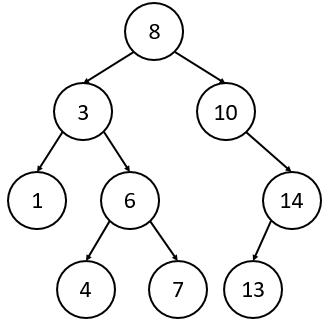
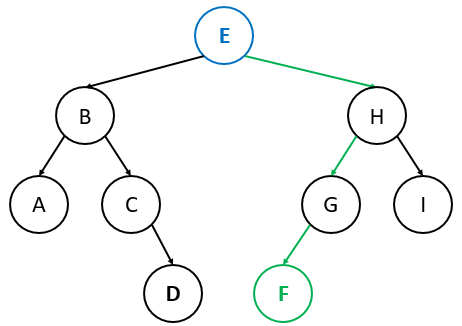
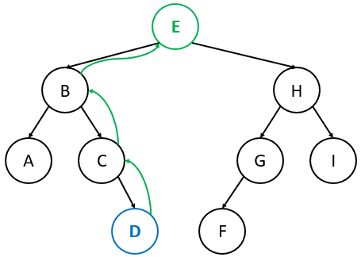
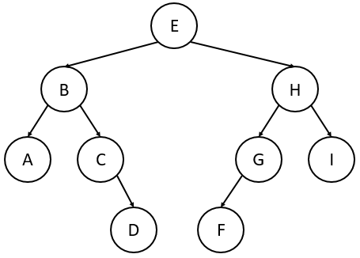
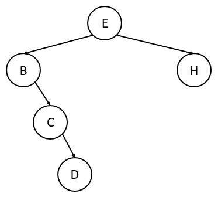

# Binary Search Trees
Formally, a BST is one in which any given node is larger than all nodes in its left subtree and smaller than all nodes in its right subtree. 
A valid BST:



The functions of a BST are **find**, **size**, **clear**, **insert**, **empty**, **successor**, and the **iterator** pattern.

## Operations
Below is pseudocode for the basic BST functions. They should be somewhat intuitive given the structure of a BST. In these examples, we assume that a BST object has two global variables: the root node (root), and an integer keeping track of the size of the BST (size). 
```
find(element): // returns True if element exists in BST, otherwise returns False
    current = root                 // start at the root
    while current != element:
        if element < current:      // if element < current, traverse left
            current = current.leftChild
        else if element > current: // if element > current, traverse right
            current = current.rightChild
        if current == NULL:        // if we traversed and there was no such child, failure
            return False
    return True // we only reach here if current == element, which means we found element
```
```
insert(element): // inserts element into BST and returns True on success (or False on failure)
    if no elements exist in the BST:       // empty tree, so element becomes the root
        root = element
        size = size + 1
        return True
    current = root                         // start at the root
    while current != element:
        if element < current:
            if current.leftChild == NULL:  // if no left child exists, insert element as left child
                current.leftChild = element
                size = size + 1
                return True
            else:                          // if a left child does exist, traverse left
                current = current.leftChild
        else if element > current:
            if current.rightChild == NULL: // if no right child exists, insert element as right child
                current.rightChild = element
                size = size + 1
                return True
            else:                          // if a right child does exist, traverse right
                current = current.rightChild
    return False // we only reach here if current == element, and we can't have duplicate elements
```
```
size(): // returns the number of elements in BST
    return size
```
```
clear(): // clears BST
    root = NULL
    size = 0
```
```
empty(): // returns True if BST is empty, otherwise returns False
    if size == 0:
        return True
    else:
        return False
```

## Successor
The successor function of a BST node finds the "successor"—the next largest node—of the node in the BST. We can break this function down into two cases:

**Case 1**: If node u has a right child, we can somewhat trivially find u's successor. Recall that, by definition, a node is smaller than all of the nodes in its right subtree. Therefore, if u has a right child, u's successor must be in its right subtree. Note that u's successor is not necessarily its right child! Specifically, if u has a right child, u's successor must be the smallest node in its right subtree. Thus, to find u's successor, we can traverse to u's right child and then traverse as far left as possible (What does this repeated left traversal do?). In the example below, we will find E's successor:



**Case 2**: If node u does not have a right child, we have to be a bit more clever. Starting at u, we can traverse up the tree. The moment we encounter a node that is the left child of its parent, the parent must be u's successor. If no such node exists, then u has no successor. In the example below (slightly different than the above example), we will find D's successor:



```
successor(u): // returns u's successor, or NULL if u does not have a successor
    if u.rightChild != NULL:             // Case 1: u has a right child
        current = u.rightChild
        while current.leftChild != NULL: // find the smallest node in u's right subtree
            current = current.leftChild
        return current
    else:                                // Case 2: u does not have a right child
        current = u
        while current.parent != NULL:    // traverse up until current node is its parent's left child
            if current == current.parent.leftChild:
                return current.parent
            else:
                current = current.parent
        return NULL // we have reached the root and didn't find a successor, so no successor exists
```

## Remove
To remove a node u from a BST, we must consider three cases. 
First, if u has no children, we can simply delete u (i.e., have u's parent no longer point to u). 
Second, if u has a single child, have u's parent point to u's child instead of to u. 
Third, if u has two children, replace u with u's successor and remove u's successor from the tree.
```
remove(element): // removes element if it exists in BST (returns True), or returns False otherwise
    current = root                 // start at the root
    while current != element:
        if element < current:      // if element < current, traverse left
            current = current.leftChild
        else if element > current: // if element > current, traverse right
            current = current.rightChild
        if current == NULL:        // if we traversed and there was no such child, failure
            return False
    // we only reach here if current == element, which means we found element
    if current.leftChild == NULL and current.rightChild == NULL:     // Case 1 (no children)
        remove the edge from current.parent to current
    else if current.leftChild == NULL or current.rightChild == NULL: // Case 2 (one child)
        have current.parent point to current’s child instead of to current
    else:                                                            // Case 3 (two children)
        s = current’s successor
        if s is its parent's left child:
            s.parent.leftChild = s.rightChild  // s.rightChild will either be NULL or a node
        else:
            s.parent.rightChild = s.rightChild // s.rightChild will either be NULL or a node
        replace current's value with s's value
```

## In-order traversal
An in-order traversal of a BST starts at the root and, for any given node, traverses left, then "visits" the current node, and then traverses right. However, what if we want to iterate through the elements of a BST in sorted order with the freedom of starting at any node that we want? Doing a full-fledged in-order traversal starting at the root would be inefficient. Instead, we can simply start at whichever node we want and repeatedly call the successor function until we reach a point where no more successors exist.
```
inOrder(): // perform an in-order traversal over the elements of BST using successor()
    current = the left-most element of BST
    while current != NULL:
        output current
        current = successor(current)
```

A tree's **height** is the longest distance from the root of the tree to a leaf, where we define "distance" in this case as the number of edges (not nodes) in a path. A tree with just a root has a height of 0, a tree with a root and one child has a height of 1, etc. For the sake of consistency, we say that an empty tree has a height of -1.
Notice that the worst-case time complexity of inserting, finding, and removing elements of a BST is proportional to the its height.

A **balanced** binary tree is one where most leaves are equidistant from the root and most internal nodes have two children. A perfectly balanced binary tree is one where all leaves are equidistant from the root, and all internal nodes have two children. The term "balanced" can be generalized to any k-ary tree (e.g. binary, ternary, 4-ary, etc.): a balanced k-ary tree is one where many (or most) internal nodes have exactly k children and all leaves are roughly equidistant from the root. Below is an example of a balanced BST:



If a binary tree is perfectly balanced, each internal node has exactly two children (or k children, if we generalize to k-ary trees) and all leaves are exactly equidistant from the root, so a perfectly balanced binary tree with n elements has a height of `log₂(n+1)-1`, and the number of nodes in the tree would be roughly `n = 2ʰ` (where h is the height of the tree).

An unbalanced binary tree is one where many internal nodes have exactly one child and/or leaves are not equidistant from the root. A perfectly unbalanced binary tree is one where all internal nodes have exactly one child. The term "unbalanced" can be generalized to any k-ary tree: an unbalanced k-ary tree is one where many internal nodes have less than k children (the more extreme deviation from k children, the more unbalanced the tree). Below is an example of an unbalanced BST:



If a tree is perfectly unbalanced, each internal node has exactly one child, so the tree would have a height of `n-1` (we would have `n` nodes down one path, and that path will have `n-1` edges: one edge between each pair of nodes along the path).