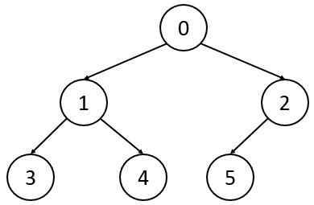
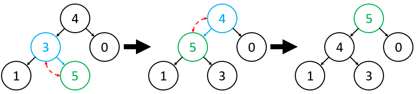
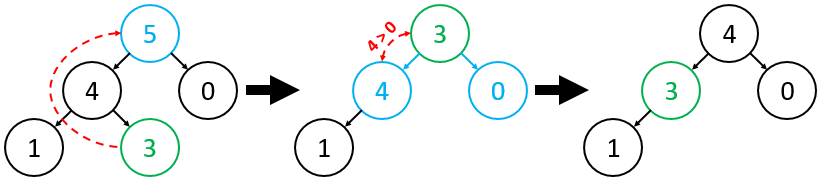

# Heap
A heap is a tree that satisfies the Heap Property: For all nodes A and B, if node A is the parent of node B, then node A has higher priority (or equal priority) than node B.

The binary heap has three constraints (two of which should hopefully be obvious):
* **Binary Tree Property**: All nodes in the tree must have either 0, 1, or 2 children
* **Heap Property**: (explained above)
* **Shape Property**: A heap is a complete tree. In other words, all levels of the tree, except possibly the bottom one, are fully filled, and, if the last level of the tree is not complete, the nodes of that level are filled from left to right

Below is an example of a heap (higher priority is given to smaller elements):



A min-heap is a heap where every node is smaller than (or equal to) all of its children (or has no children). In other words, a node A is said to have higher priority than a node B if A < B (i.e., when comparing two nodes, the smaller of the two has higher priority).

A max-heap is a heap where every node is larger than (or equal to) all of its children (or has no children). In other words, a node A is said to have higher priority than a node B if A > B (i.e., when comparing two nodes, the larger of the two has higher priority). 

## Insertion
First, recall that one of the constraints of a heap is that it must be a complete tree. Given this constraint, the first step of the heap insertion algorithm is quite intuitive: simply insert the new element in the next open slot of the tree (the new node will be a leaf in the bottom level of the tree, by definition of "next open slot"). In doing so, we have maintained the _Shape Property_, so the only constraint that might be violated is the _Heap Property_: the new element might potentially have higher priority than its parent, which would make the heap invalid.

Thus, the next (and last) step of the insertion algorithm should be intuitive as well: we must fix the (potentially) disrupted _Heap Property_ of our tree. To do so, we must bubble up the newly-inserted element: if the new element has a higher priority than its parent, swap it with its parent; now, if the new element has higher priority than the new parent, swap; repeat until it has reached its correct place (either its priority is less than or equal to its parent's priority, or it is the root of the tree).

Formally, the pseudocode of heap insertion is as follows:
```
insert(element):
    place element in next open slot (as defined by a "complete tree")
    while element has a parent and element.priority > element.parent.priority:
        swap element and element.parent
```
Below is a visualization of the heap insertion algorithm, where we insert 5 into the existing max-heap:



Note that, in the above algorithm, we assumed that we have direct (i.e., constant-time) access to the "next open slot" of the tree. We will soon see that this is easily achievable when implementing the heap.

## Removal
First, recall that the root element is by definition the highest-priority element in the heap. Thus, since we always remove the highest-priority element of a heap, the first step is to simply remove the root. However, since we need a valid tree structure, we need some other node to become the new root. In order to maintain the Shape Property of the heap, we can simply place the "last" element of the heap (i.e., the rightmost element of the bottom row of the heap) as the new root.

By making the "last" element of the heap the new root, we most likely have violated the Heap Property: the new root might have lower priority than any of its children, which would make the heap invalid. Thus, the next (and last) step of the "pop" algorithm should be intuitive as well: we must fix the (potentially) disrupted Heap Property of our tree. To do so, we must trickle down the newly-placed root: if the root has lower priority than any of its children, swap it with its highest-priority child; now, if it still has lower priority than any of its children in this new position, swap with its highest-priority child again; repeat until it has reached its correct place (either its priority is greater than or equal to the priorities of all of its children, or it is a leaf of the tree).

Formally, the pseudocode of heap removal is as follows:
```
pop():
    replace the root with the rightmost element of the bottom level of the tree (call it "curr")
    while curr is not a leaf and curr has lower priority than any of its children:
        swap curr and its highest-priority child
```
Below is a visualization of the heap "pop" algorithm, where we pop from the existing max-heap:



**NB**: Because of the _Shape Property_ of a heap, we are guaranteed to have a perfectly balanced binary tree, which means that we are guaranteed to have _**O(log n)**_ levels in our tree. If we have _**L**_ levels in our tree, in the worst case, we do _**L-1**_ comparisons for the trickle down process. As a result, if L = _**O(log n)**_ and we do _**O(L)**_ comparisons for insertion and removal, the overall algorithm is _**O(log n)**_.

## Storing a binary heap as an array
Although we like visualizing a binary heap as a tree structure with nodes and edges, when it comes to implementation, by being a little clever, it turns out that we can store a binary heap as an array. Technically, any binary tree can be stored as an array, and by storing a binary tree as an array, we can avoid the overhead of wasted memory from parent and child pointers. Thus, given an index in the array, we can find the element's parent and children using basic arithmetic. An added bonus with binary heaps over unbalanced binary trees is that, since a binary heap is by definition a complete tree, there is no wasted space in the array: all elements will be stored perfectly contiguously.

Below is a diagram showing how we can represent an example binary max-heap as an array, where the tree representation is shown to the left and the array representation (with the edges maintained for the sake of clarity) is shown to the right:


Notice that, in the array representation, we can access the parent, left child, or right child of any given element in constant time using simple arithmetic. For an element at index i of the array, using 0-based indexing,
* its **parent** is at index `floor((i-1) / 2)`
* its **left child** is at index `2i + 1`
* its **right child** is at index `2i + 2`

Also, recall that we previously assumed constant-time access to the "next open slot" of the heap. When a heap with n elements is implemented as an array, the heap's "next open slot" is at index n (using 0-based indexing).
