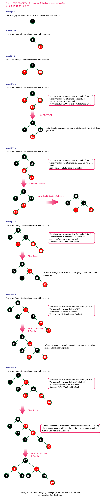

Red - Black Tree 
=================
Red - Black Tree is a BST variant in which every node is colored either RED or BLACK. The color of a node is decided based on the properties of Red-Black Tree.

Properties
==========
*   **Property #1:** Red - Black Tree must be a BST.
*   **Property #2:** The ROOT node must be colored BLACK.
*   **Property #3:** The children of Red colored node must be colored BLACK. (There should not be two consecutive RED nodes).
*   **Property #4:** In all the paths of the tree, there should be same number of BLACK colored nodes.
*   **Property #5:** Every new node must be inserted with RED color.
*   **Property #6:** Every leaf (e.i. NULL node) must be colored BLACK.

Below is a Red-Black Tree which is created by inserting numbers from 1 to 9:

Every Red Black Tree is a BST but every BST need not be Red Black tree.**

Insertion
=========
Every new node must be inserted with the color RED. The insertion operation in Red Black Tree is similar to insertion operation in a BST. But it is inserted with a color property. After every insertion operation, we need to check all the properties of Red-Black Tree. If all the properties are not satisfied, we perform the following operations to make it a Red Black Tree:

1.  **Recolor**
2.  **Rotation**
3.   **Rotation followed by Recolor**

Steps:
*   Step 1 - Check whether tree is Empty.
*   Step 2 - If tree is Empty then insert the **newNode** as Root node with color **Black** and exit from the operation.
*   Step 3 - If tree is not Empty then insert the newNode as leaf node with color Red.
*   Step 4 - If the parent of newNode is Black then exit from the operation.
*   Step 5 - If the parent of newNode is Red then check the color of parentnode's sibling of newNode.
*   Step 6 - If it is colored Black or NULL then make suitable Rotation and Recolor it.
*   Step 7 - If it is colored Red then perform Recolor. Repeat the same until tree becomes Red Black Tree.

Deletion
========
The deletion operation in Red-Black Tree is similar to deletion operation in a BST. But after every deletion operation, we need to check the Red-Black Tree properties. If any of the properties are violated then make suitable operations like Recolor, Rotation and Rotation followed by Recolor to make it Red-Black Tree.
