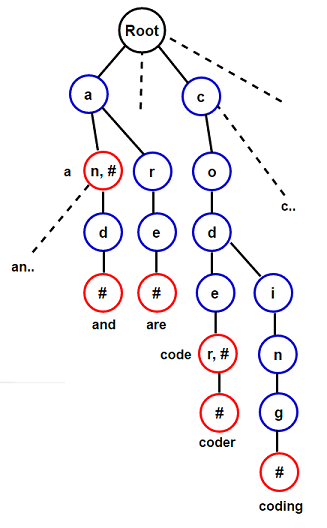

## Trie
**Trie** is a tree-based data structure, which is used for efficient re**trie**val of a key in a large data-set of strings. Unlike a binary search tree, where node in the tree stores the key associated with that node, in trie node’s position in the tree defines the key with which it is associated and the key are only associated with the leaves. It is also known as prefix tree as all descendants of a node have a common prefix of the string associated with that node, and the root is associated with the empty string.

Representation
--------------
There are several ways to represent tries, corresponding to different trade-offs between memory use and speed of the operations. The basic form is that of a linked set of nodes, where each node contains an array of child pointers, one for each symbol in the alphabet (so for the English alphabet, one would store 26 child pointers and for the alphabet of bytes, 256 pointers). Trie node also maintains flag which specifies whether it corresponds to the end of the key or not.

As illustrated in above figure, each key is represented in the trie as a path from the root to the internal node or a leaf.

**Insertion** proceeds by walking the trie according to the string to be inserted, then appending new nodes for the suffix of the string that is not contained in the trie. **Searching** also proceeds the similar way by walking the trie according to the string to be search, returning false if the string is not found. **Deletion** is little bit complicated. The idea is to delete the key in bottom up manner using recursion. Special care has to be taken while deleting the key as it can be prefix of another key or its prefix can be another key in Trie.

Performance
-----------
Time complexity of a Trie data structure for insertion/deletion/search operation is just O(n) where n is key length.

Space complexity of a Trie data structure is O(N\*M\*C) where N is the number of strings and M is the highest length of the string and C is the size of the alphabet. Please refer below post for memory efficient implementation of the Trie –

Applications
------------
There are numerous applications of Trie data structure which take advantage of a trie’s ability to quickly search, insert, and delete entries.

###### 1. As a replacement for other data structures
Trie has a number of advantages over binary search trees. It can also be used to replace a hash table as lookup is generally faster in trie even in the worst case. Also there are no collisions of different keys in a trie and a trie can provide an alphabetical ordering of the entries by key.

###### 2. Autocomplete / Dictionary
A common application of a trie is storing a predictive text or autocomplete dictionary, such as found on a mobile telephone or search engines. Autocomplete (or word completion) is a feature in which an application predicts the rest of a word the user is typing.

###### 3. Spell checker
Spell checker flags words in a document that may not be spelled correctly. Spell checkers  are commonly used in word processor (like MS word), email client, search engine, etc.

###### 4. Lexicographic sorting of a set of keys
Lexicographic sorting of a set of keys can be accomplished with a simple trie-based algorithm. We initially insert all keys in a trie and then print all keys in the trie by performing pre-order traversal (depth-first traversal), which results in output that is in lexicographically increasing order.

###### 5. Longest prefix matching
Longest prefix match algorithm is used by routers in Internet Protocol (IP) networking to select an entry from a forwarding table.
