# Ranking
### Ranking employees by salary from highest to least
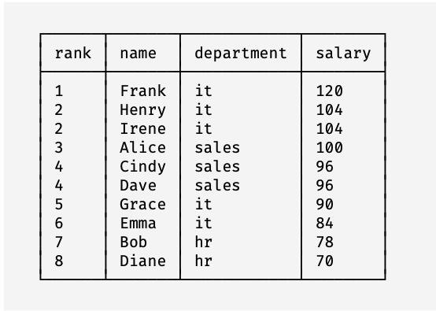

```sql
select 
  dense_rank() over w as "rank", name, department, salary
from employees
window w as (
  order by salary desc
)
order by "rank", id;

select 
  dense_rank() over (order by salary desc) as "rank", name, department, salary
from employees
order by "rank", id;
```

### Group employees by cities and high, medium and low salaries
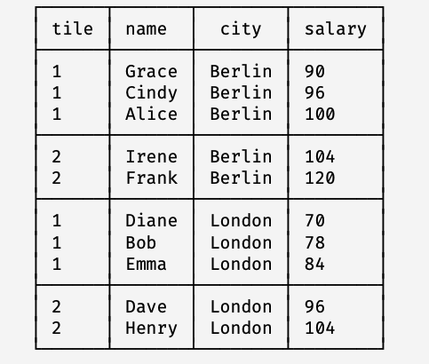

```sql
select
  ntile(2) over w as tile, name, city, salary
from employees
window w as (
  partition by city 
  order by salary
)
over by city, salary, id;
```

### Take employees with rank = 1
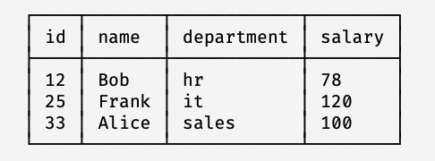

```sql
with data as (
  select
    id, name, department, salary, dense_rank() over w as emp_rank
  from employees
  window w as (
    partition by department 
    order by salary desc
  )
)
select id, name, department, salary
from data
where emp_rank = 1;
```

# Offset
### Sibling employee salary
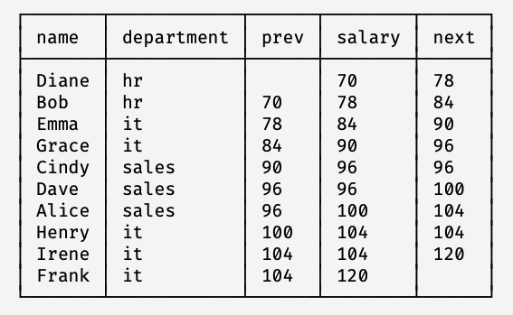
```sql
select
  name, department, lag(salary, 1) over w as prev, salary, lead(salary, 1) over w as next
from employees
window w as (order by salary)
order by salary, id;
```

### Group by departments and salary bounds
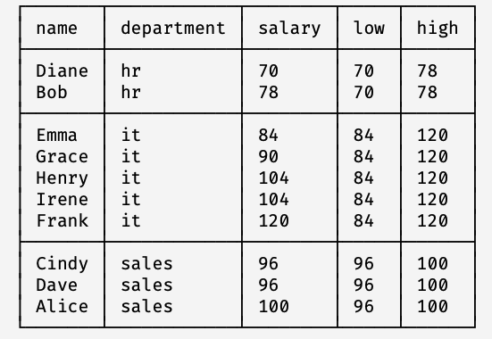
```sql
select
  name, department, salary, first_value(salary) over w as low, last_value(salary) over w as high
from employees
window w as (
  partition by department
  order by salary
  rows between unbounded preceding and unbounded following
)
order by department, salary, id;
```

### Salary to max city salary ratio
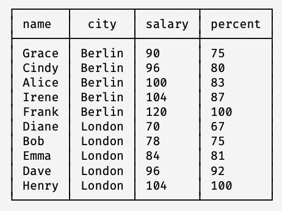
```sql
select
  name, city, salary, round(salary*100.0 / last_value(salary) over w) as percent
from employees
window w as (
  partition by city
  order by salary
  rows between unbounded preceding and unbounded following
)
order by city, salary, id;
```

# Aggregation
### Employee salary percentage of department salary fund
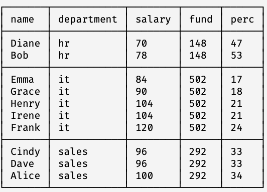
```sql
select
  name, department, salary, sum(salary) over w as fund, round(salary * 100.0 / sum(salary) over w) as perc
from employees
window w as (partition by department)
order by department, salary, id;
```

### Average department salary
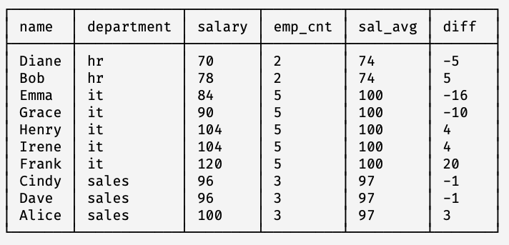
```sql
select
  name, department, salary,
  count(*) over w as emp_cnt,
  round(avg(salary) over w, 0) as sal_avg,
  round(
    (salary - avg(salary) over w) * 100.0 / avg(salary) over w
  ) as diff
from employees
window w as (partition by department)
order by department, salary, id;
```

### Salary fund for just one city
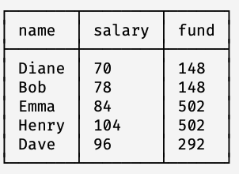
```sql
with emp as (
  select
    name, city, salary, sum(salary) over w as fund
  from employees
  window w as (partition by department)
  order by department, salary, id
)
select name, slaary, fund
from emp where city = 'London';
```

### Empty inline window over all rows
```sql
select
  name, department, salary, count(*) over () as emp_count, sum(salary) over () as fund
from employees
order by department, salary, id;
```

# Rolling aggregates
### 3-month rolling average expenses
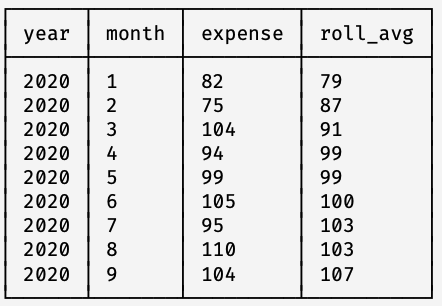
```sql
select
  year, month, expenses, round(avg(expenses) over w) as roll_avg
from expenses
where year = 2020 and month <= 9
window w as (
  order by year, month
  rows between 1 preceding and 1 following
)
order by year, month;
```

### Income moving average for the previous and current months
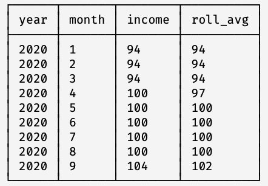
```sql
select
  year, month, income, round(avg(income) over w) as roll_avg
from expenses
where year = 2020 and month <= 9
window w as (
  order by year, month
  rows between 1 preceding and current row
)
order by year, month;
```

### Cumulative income & expenses
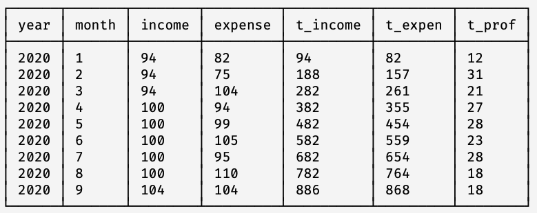
```sql
select
  year, month, income, expense
  sum(income) over w as t_income,
  sum(expense) over w as t_expense,
  sum(income) over w - sum(expense) over w as t_profit
from expenses
where year = 2020 and month <= 9
window w as (
  order by year, month
  rows between unbounded preceding and current row
)
order by year, month;
-- "rows between unbounded preceding and current row" is the default window frame
```


# Statistics
### Percentage of people paid same or less
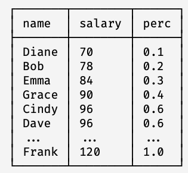
```sql
select
  name, salary, cume_dist() over w as perc
from employees
window w as (order by salary)
order by salary, id;
```

### Percentage of people paid strictly less
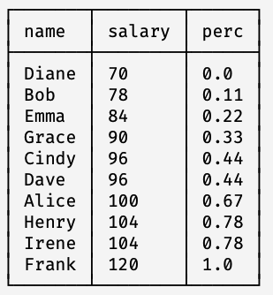
```sql
select
  name, salary, round(percent_rank() over w, 2) as perc
from employees
window w as (order by salary)
order by salary, id;

-- percent_rank (% of records where order by value < current)
-- cume_dist (% of records where order by value <= current)
-- They support partitions but not frames
```

### Median and 90th percentile salaries
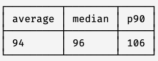
```sql
select
  round(avg(salary)) as average,
  percentile_disc(0.50) within group (order by salary) as median,
  percentile_disc(0.90) within group (order by salary) as p90
from employees;

-- percentile_disc treats datasets as discrete, while percentile_cont treats datasets as continuous
```

#### DB support for percentiles
* SQLite and MySQL - No support
* PostgreSQL - Partial support, without windows
* MS SQL & Oracle - Full support, with windows

# Groups
### Cumulative total over rows and groups
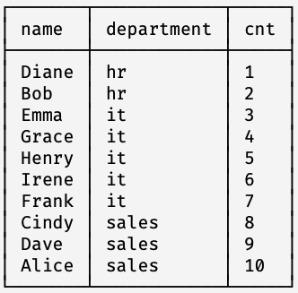
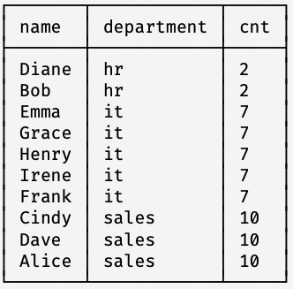
```sql
select 
  name, department, count(*) over w as cnt
from employees
window w as (
  order by department
  rows between unbounded preceding and current row
)
order by department, id;
```
```sql
select 
  name, department, count(*) over w as cnt
from employees
window w as (
  order by department
  groups between unbounded preceding and current row
)
order by department, id;
```

### Number of employees with same or higher salary
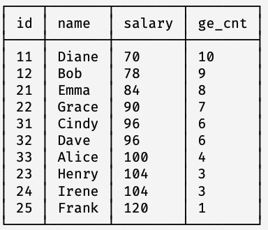
```sql
select
  id, name, salary, count(*) over w as ge_cnt
from employees
window w as (
  order by salary
  groups between current row and unboounded following
)
order by salary, id;
```
### Next higher salary
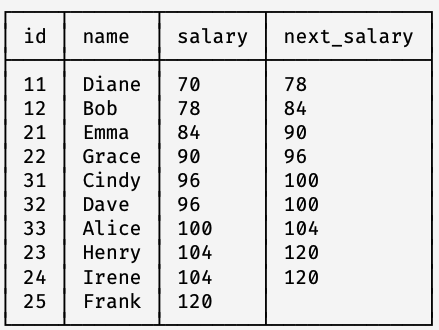
```sql
select
  id, name, salary, first_value(salary) over w as next_salary
from employees
window w as (
  order by salary
  groups between 1 following and 1 following
)
order by salary, id;
```

# Range
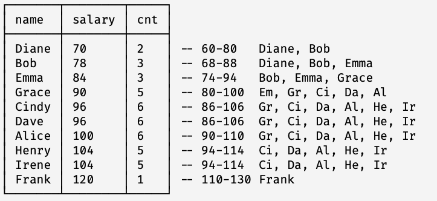
```sql
select
  name, salary, count(*) over w as cnt
from employees
window w as (
  order by salary
  range between 10 preceding and 10 following
)
order by salary, id;
```

`current row` for group & range frames means the current record & all equal to it.

# Exclude
### How average salary changes if an employee is fired
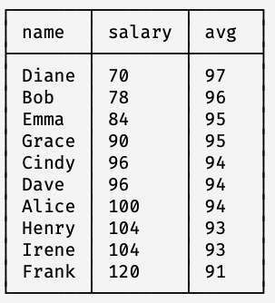
```sql
select
  name, salary, round(avg(salary) over w) as "avg"
from employees
window w as (
  rows between unbounded preceding and unbounded following
  exclude current row
)
order by salary, id;
-- MySQL and SQL Server does not support excludes
-- Exclude variants:
-- exclude no others - default if exclude is not specified
-- exclude current row
-- exclude group - Exclude the current record and all equal to it.
-- exclude ties - Keep the current record but exclude all equal to it.
```

# Filter
### How would total salary fund change if 1 person is fired and the rest are given a 10% raise, or IT is fired and the rest get a 50% raise
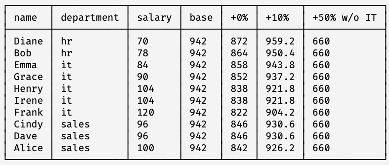
```sql
select
  name, department, salary,
  sum(salary) over () as "base",
  sum(salary) over w as "+0%",
  sum(salary*1.1) over w as "+10%",
  sum(salary*1.5)
    filter(where department <> 'it')
    over () as "+50% w/o IT"
from employees
window w as (
  rows between unbounded preceding and unbounded following
  exclude current row
)
order by id;
-- Filter not supported by Oracle, MySQL and SQL Server
-- case alternative
sum(
  case when department <> 'it' then salary*1.5 else 0 end
  ) over () as "+50% w/o IT"
```


### Lay-off 1, increase rest (except IT) by 10%
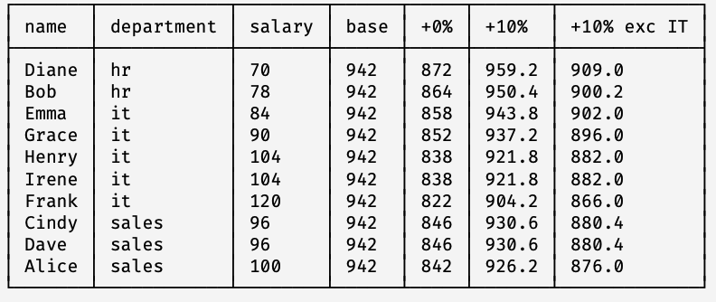
```sql
select
  name, department, salary,
  sum(salary) over () as "base",
  sum(salary) over w as "+0%",
  sum(salary*1.1) over w as "+10%",
  sum(
    case when department = 'it' then salary else salary*1.1 end
  ) over w as "+10% except IT"
from employees
window w as (
  rows between unbounded preceding and unbounded following
  exclude current row
)
order by id;
-- Case can support complex filterings
```


### Percentage of salary to the Berlin and London averages
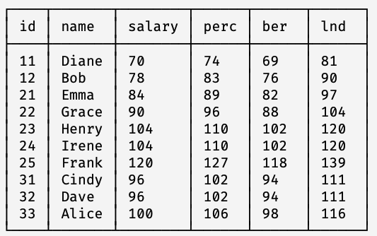
```sql
select
  id, name, salary
  round(salary * 100 / avg(salary) over ()) as perc,
  round(salary * 100 / avg(salary) filter(where city = 'Berlin') over ()) as ber,
  round(salary * 100 / avg(salary) filter(where city = 'London') over ()) as lnd
from employees
order by id;
```

## Report heuristics
* Aggregate first, windows later
* Window first, filter later